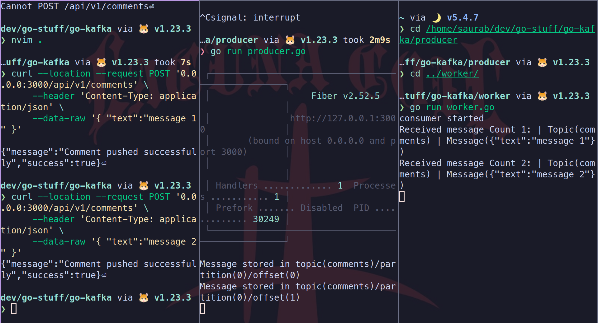

# Learning Kafka basics with Golang 

This is a simple project to implement Kafka producer and consumer in Go.

## What is Kafka?
Kafka is a distributed event streaming platform. It is used for handling real-time data streaming, message queues, publishing/subscribing, and much more.

## Sarama
Sarama is a library for Apache Kafka written in Go. It provides a high-level API for producing and consuming messages from Kafka topics.

# Run this project

```bash
docker compose up -d
cd producer
go run producer.go
cd ..
cd worker
go run worker.go
```

# Demo

